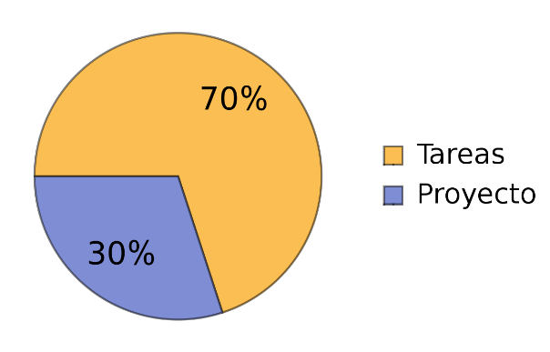
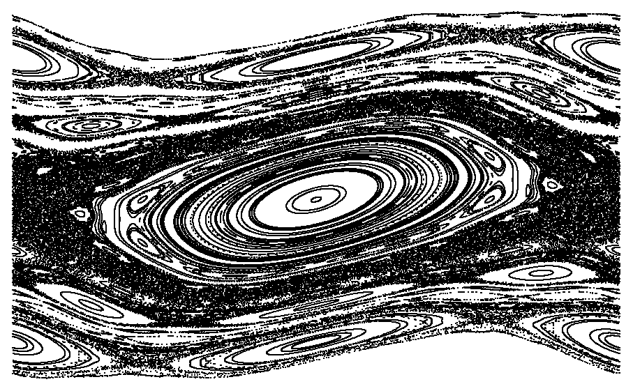

Física Computacional
===============================

En el curso abordaremos los conceptos dispuestos por el temario _link_ en un ambiente fresco con herramientas de frontera. Se le dará especial
atención a la teoría del curso en orden de que la práctica sea lo más clara  posible.

Se incentivará el uso de `git` y `jupyter-notebook` y `Julia` como lenguaje de programación.

El temario se abordará de la siguiente forma:

Temario
---------------------------------

1. Introducción 
	* Introducción a git

	* Introducción a Julia
		* Representación de los números en la máquina.
		* Estructuras básicas.
		* Creación de librerias.
		
2. Metodos básicos
	* Metodo de Newton-Raphson
		* Computo de la raíz cuadrada: analisis del error.
		* Integración y derivación númerica.
	
3. Ecuaciones diferenciales
	* Ecuaciones ordinarias
		* Método de Euler.
		* Método de Runge-Kutta.
		* Estabilidad de las soluciones.
		* Sistemas no-autónomos: El rotor pateado.
	
	* Ecuaciones parciales: 
		* Condicion de valores en la frontera.
		* Ecuación de onda.
		* Ecuación de Schrodinger.
	
4. Problemas matriciales
	* Inversión de matrices.
	* Computo de eigenvalores y eigenvectores.
	* Discretización de operadores lineales.

5. Métodos avanzados y simulación computacional
	* Monte Carlo
	* Problemas de interes actual
		* Problemas de la óptica cuántica.
		* Problemas de caos clásico y cuántico.
		* Teoria de representaciones de canales cuánticos.

Evaluación
---------------------------------

Las tareas y los ejercicios en clase (si no los terminan se dejan de tarea) tendrán un valor propuesto del 70% mientras que el 30% estará destinado
a un proyecto final, el cual será tentativamente individual, sin embargo se considerará formar equipos según convenga. Se dará mínimo mes y medio para el desarrollo del proyecto,
es decir, deberán elegir con tiempo su proyecto, puede ser incluso a comienzos del semestre.

El proyecto se presentará al final del semestre usando `jupyter-notebook` o `beamer` según prefiera el alumno. 

Temas para los proyectos propuestos
---------------------------------

Tanto el profesor como el ayudante podemos brindar apoyo y bibliografía en temas tales como:

* Óptica cuántica.

* Sistemas abiertos cuánticos.

* Caos clásico y cuántico.

* Sistemas dinámicos.

* Algunos sistemas complejos.

Si al alumno le interesa algún otro tema, quizá en relación con su tesis y del cual el profesor no tenga conocimiento, 
puede abordar un proyecto afín proporcionando la bibliografía y un cronograma tentativo para el proyecto.

### Proyectos propuestos:

* Caos clásico
	* Análisis general de las propiedades del rotor pateado.
	* Cálculo de algunas cantidades básicas del mapeo logístico.
	* Programar herramientas básicas para el análisis espectral del espectro de sistemas cuánticos complejos.
	* Análisis general del mapeo del círculo.

* Sistemas complejos
	* Programación y estudio de autómatas celulares.
	* Programación de la cadena Ising pateada.
	* Billares clásicos y cuánticos.

* Sistemas abiertos cuánticos y óptica cuántica.
	* Programar _toolbox_ o aprender usar las librerías existentes para análisis de sistemas de la óptica cuántica.
	* Programar ensambles de matrices aleatorias y analizar sus propiedades.

* Ecuaciones diferenciales
	* Programar alguna de las ecuaciones diferenciales más conocidas con condiciones de frontera interesantes.
		* Ecuación de calor, de Schrödinger, de onda, etc.
		
